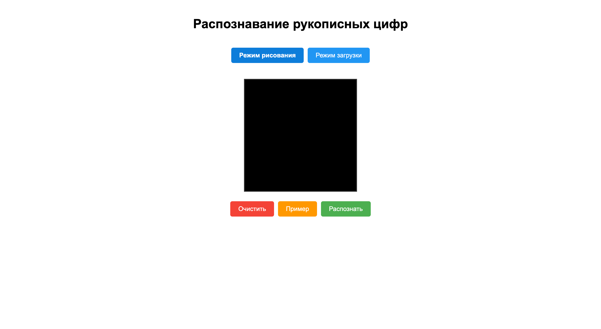
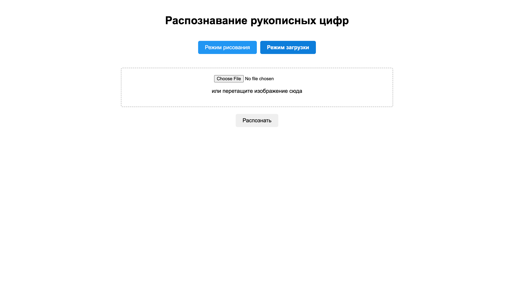

# mnist-api

---

## [Гайд](./How-to-do)

---

### Для запуска
```bash
uvicorn main:app --reload
```

### После перейти на http://127.0.0.1:8000

---

### Интерфейс
#### Главная страничка:


#### Страничка загрузки:


#### Пример использования:


---

### Модельку сделал <a href="https://github.com/sackvoich">@sackvoich</a>
### Arigato!